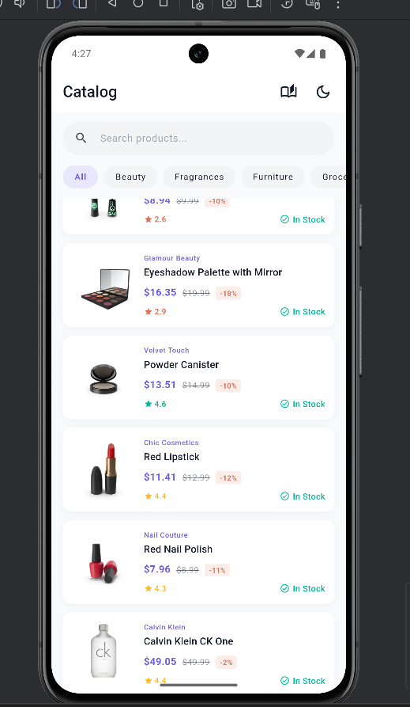
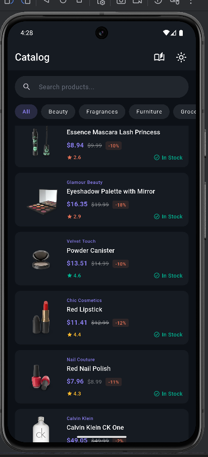
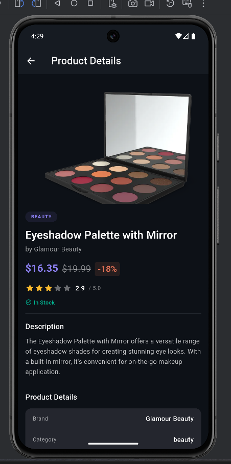
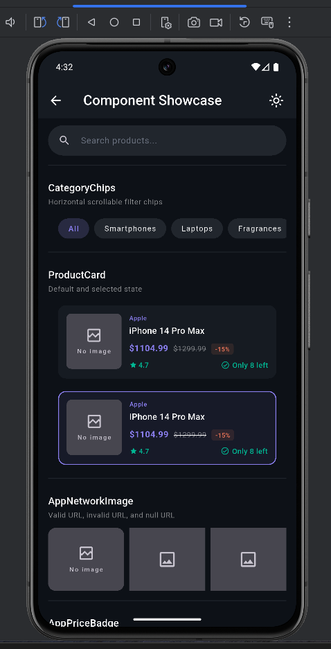

# Tech Gadol – Product Catalog App

A senior-level Flutter assessment submission demonstrating a production-grade product catalog application with a custom design system, Bloc state management, responsive layout, deep linking, and comprehensive test coverage.

---

## 1. Setup & Run Instructions

### Prerequisites

| Tool | Version |
|------|---------|
| Flutter | `3.19.x` (stable) |
| Dart | `3.3.x` |
| Xcode (iOS) | `15.x` |
| Android SDK | API 34+ |

### Steps

```bash
# 1. Clone the repository
git clone https://github.com/your-username/tech_gadol_catalog.git
cd tech_gadol_catalog

# 2. Install dependencies
flutter pub get

# 3. Run the app (debug)
flutter run

# 4. Run on a specific device
flutter run -d chrome           # Web
flutter run -d ios              # iOS Simulator
flutter run -d android          # Android Emulator

# 5. Run in release mode
flutter run --release
```

### Running Tests

```bash
# All tests
flutter test

# Unit tests only
flutter test test/unit/

# Widget tests only
flutter test test/widget/

# With coverage
flutter test --coverage
genhtml coverage/lcov.info -o coverage/html
open coverage/html/index.html
```

### Building

```bash
# Android APK
flutter build apk --release

# iOS
flutter build ios --release
```

---

## 2. Architecture Overview

### Folder Structure

```
lib/
├── main.dart                          # App entry point
├── core/
│   ├── constants/
│   │   └── api_constants.dart         # Base URL, endpoints, debounce ms
│   ├── di/
│   │   └── injection.dart             # GetIt service locator registration
│   ├── errors/
│   │   ├── exceptions.dart            # AppException hierarchy
│   │   └── failures.dart              # Failure hierarchy (for Either)
│   ├── network/
│   │   └── network_client.dart        # Dio client with interceptors
│   ├── router/
│   │   └── app_router.dart            # GoRouter config + deep linking
│   └── theme/
│       └── app_theme.dart             # ThemeData + design tokens
│
├── data/
│   ├── datasources/
│   │   └── product_remote_datasource.dart
│   ├── models/
│   │   └── product_model.dart         # JSON serialization + validation
│   └── repositories/
│       └── product_repository_impl.dart
│
├── domain/
│   └── repositories/
│       └── product_repository.dart    # Abstract interface
│
└── presentation/
    ├── bloc/
    │   ├── category/                  # CategoryCubit
    │   ├── product_detail/            # ProductDetailBloc
    │   ├── product_list/              # ProductListBloc
    │   └── theme/                     # ThemeCubit
    ├── pages/
    │   ├── product_list_page.dart
    │   ├── product_detail_page.dart
    │   └── showcase_page.dart
    └── widgets/
        ├── design_system/             # Reusable DS components
        │   ├── app_badges.dart        # AppPriceBadge, AppRatingBadge, AppStockBadge
        │   ├── app_network_image.dart # Cached image with fallback
        │   ├── app_search_bar.dart    # Search input with clear
        │   ├── app_states.dart        # AppErrorState, AppEmptyState
        │   ├── category_chip.dart     # CategoryChip + CategoryChipRow
        │   └── skeleton_loader.dart   # Shimmer skeleton
        ├── product/
        │   ├── product_card.dart      # List item card
        │   └── product_image_gallery.dart # Swipeable gallery
        └── responsive_layout.dart     # MasterDetailLayout + breakpoints
```

### State Management – Bloc/Cubit

The app uses `flutter_bloc` with a clean separation of concerns:

| Bloc/Cubit | Responsibility |
|---|---|
| `ProductListBloc` | Products list, search, category filter, pagination, pull-to-refresh |
| `ProductDetailBloc` | Single product fetch and error/refresh handling |
| `CategoryCubit` | Fetch and cache category list |
| `ThemeCubit` | Light/dark/system theme toggle |

All states explicitly model: `initial`, `loading`, `loaded`, `error`, and `empty`. Events are sealed via abstract classes. States use `Equatable` for efficient rebuilds.

### Dependency Injection

`GetIt` is used as the service locator. All registrations live in `core/di/injection.dart`:
- **Singletons**: `Logger`, `NetworkClient`, `ProductRepository`
- **Factories**: All Blocs (a new instance per page/use)

### Navigation

`GoRouter` handles:
- Declarative routing via named routes
- Deep linking: `/products/:id`
- Responsive routing: on tablet (≥768px), the list and detail are shown side-by-side without push navigation

---

## 3. Screenshots

| Screen | Description |
|---|---|
|  | Main product catalog showing category chips, search bar, pricing badges, and pagination in light mode. |
|  | Main product catalog showing category chips, search bar, pricing badges, and pagination in dark mode. |
|  | Detailed product view in dark mode with gallery, pricing, rating, stock status, and product metadata. |
|  | Showcase page demonstrating key design system components such as badges, states, skeleton loaders, and responsive layouts. |

---

## 4. Design System Rationale

### Design Tokens (`app_theme.dart`)

All visual constants are centralized:

```dart
AppRadius.md     // Border radii
AppSpacing.lg    // Spacing grid (4pt base)
AppDuration.fast // Animation durations
AppTheme.primaryColor // Brand palette
```

### Component API Decisions

**`AppNetworkImage`**
- Wraps `CachedNetworkImage` for lazy loading and disk caching
- Validates URL format before attempting fetch; logs warning if invalid
- Graceful degradation: shimmer → image → broken image placeholder
- Accepts optional `heroTag` for shared element transitions

**`AppSearchBar`**
- Manages its own `TextEditingController` if not provided (or accepts external)
- Exposes `onChanged` callback; debouncing is handled at the Bloc layer (`Timer`)
- Animated clear button that appears/disappears on text change

**`CategoryChipRow`**
- Stateless; selected state is driven by the parent Bloc
- Renders an "All" chip at index 0 that deselects any filter
- Category labels auto-capitalize and replace hyphens with spaces

**`AppPriceBadge`**
- Handles: `null` price, negative price → "Price unavailable"
- Shows original + discounted price with % badge when discount > 0
- Color-coded by discount presence

**`AppStockBadge`**
- Green for in-stock (≥10), amber for low-stock (<10), red for out-of-stock
- Adaptive copy: "In Stock", "Only N left", "Out of Stock"

**`ProductCard`**
- Fully `const`-compatible structure via `ValueKey(product.id)`
- `isSelected` prop for tablet master-detail highlight
- Hero transition on thumbnail

### Theming

Both `lightTheme` and `darkTheme` are defined from a `ColorScheme.fromSeed` base, ensuring Material 3 compliance. All design system components use `Theme.of(context)` — zero hardcoded colors inside widgets.

---

## 5. Limitations & Future Improvements

### Shortcuts Taken

- **No offline support**: Implemented as Enhancement B, which was prioritized lower than functionality and tests. `CachedNetworkImage` handles image caching, but product list data is not persisted to local storage.
- **Search + category combined**: When both a search query and a category filter are active, the app currently favors search (calls the search endpoint). Proper combined filtering would either require client-side intersection or a backend query parameter.
- **No pagination for search**: The DummyJSON search endpoint supports `skip`/`limit` but implementing paginated search was deprioritized in favor of correctness on the base case.

### Improvements with More Time

1. **Offline caching with Hive or Isar**: Cache paginated product pages keyed by `{query}:{category}:{skip}`. Show stale-while-revalidate UX.
2. **Hero / shared element transitions**: Fully animate the product thumbnail from card to detail screen using Flutter's `Hero` widget (tag wiring is in place).
3. **Staggered list animations**: Use `AnimationController` + `Interval` curves for a staggered fade-in of list items on first load.
4. **Theme switch animation**: Use `AnimatedTheme` or `TweenAnimationBuilder` to cross-fade between light and dark themes.
5. **Integration / golden tests**: Capture golden images of key screens and compare on CI.
6. **Accessibility**: Add `Semantics` wrappers to badges and cards; test with TalkBack/VoiceOver.
7. **Performance**: Profile the list with DevTools; add `RepaintBoundary` where needed; evaluate `SliverList` with `SliverChildBuilderDelegate` for large lists.
8. **Error analytics**: Integrate Sentry or Firebase Crashlytics for production error tracking.

---

## 6. AI Tools Usage

**Claude (Anthropic)** was used during this assessment as follows:

### Where AI Was Used

| Area | Usage |
|---|---|
| Boilerplate scaffolding | Generated initial Dio client interceptor structure and GetIt registration pattern, which was then reviewed and modified for this project's specific error hierarchy |
| Test case generation | Suggested initial test case outlines for Bloc states; all edge cases (negative price, 404 vs general server error, debounce behavior) were added manually |
| README structure | AI suggested the section headings; all content was written from scratch based on actual implementation decisions |

### What Was Changed / Refined

- The AI-suggested `_ErrorInterceptor` used a generic catch-all; it was refactored to map each `DioExceptionType` to the correct custom exception type
- Initial widget test suggestions did not cover the `isSelected` ProductCard state or the `AppPriceBadge` null/negative price paths — these were added manually
- The responsive layout approach (using `LayoutBuilder` + `MasterDetailLayout` rather than navigator branches) was a deliberate architectural decision not suggested by AI, based on avoiding nested navigator complexity with GoRouter's ShellRoute
- All naming, token values, and component API shapes reflect personal design decisions

---

## API Reference

**Base URL**: `https://dummyjson.com`

| Endpoint | Usage |
|---|---|
| `GET /products?limit=20&skip=0` | Paginated product list |
| `GET /products/search?q=...` | Server-side search |
| `GET /products/categories` | All categories |
| `GET /products/category/{name}` | Filter by category |
| `GET /products/{id}` | Single product detail |
